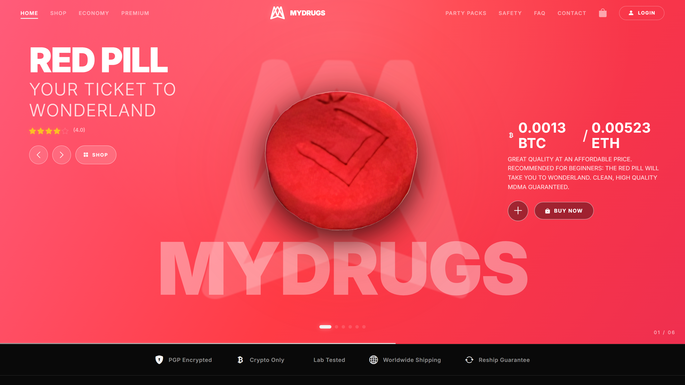
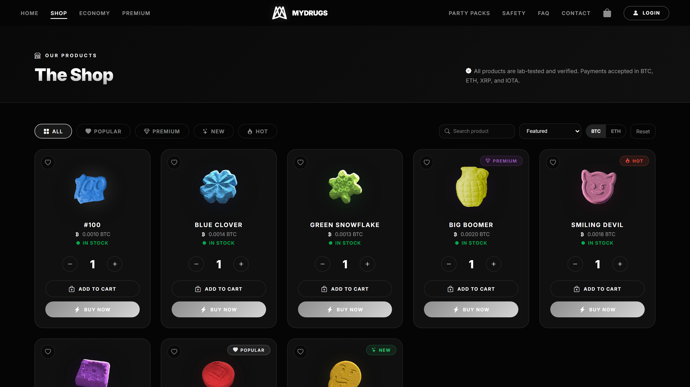
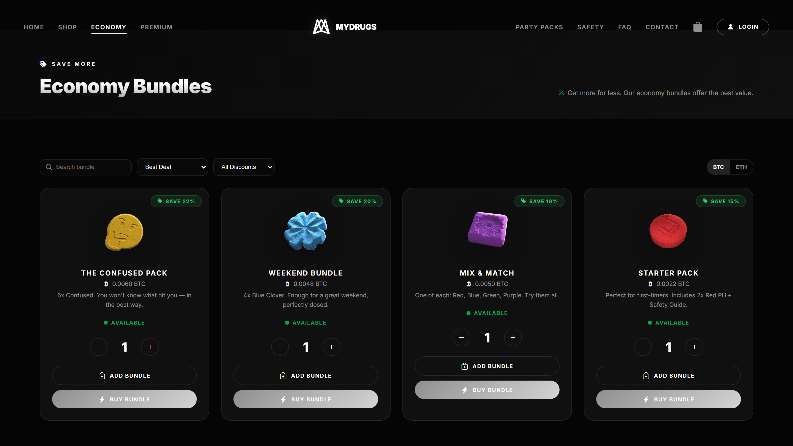
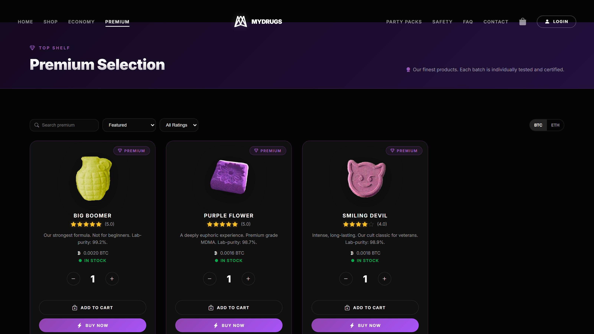
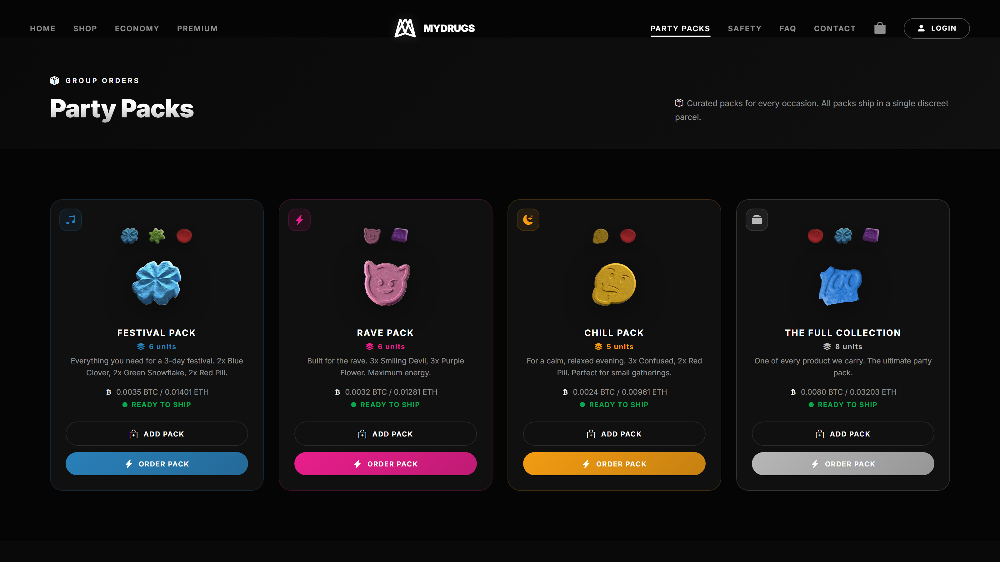
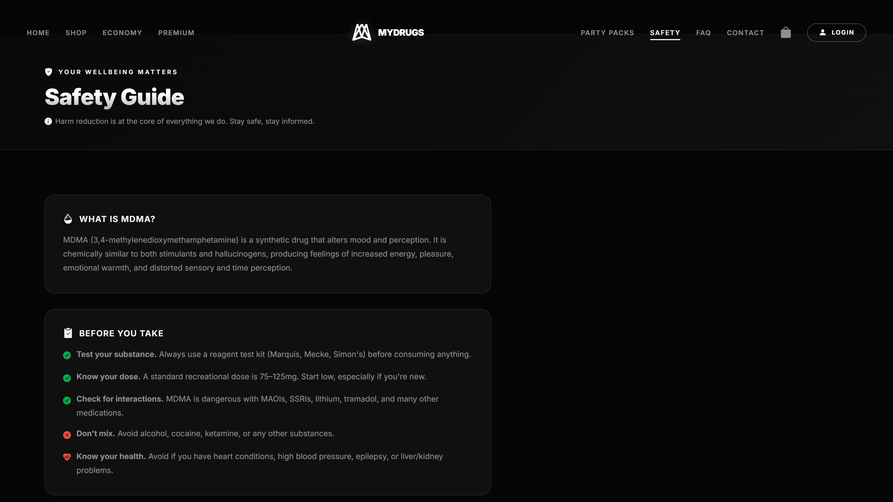
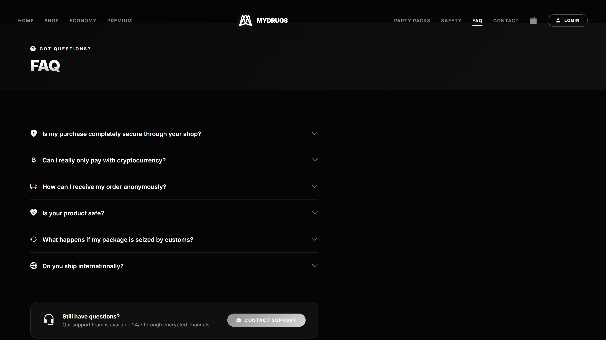
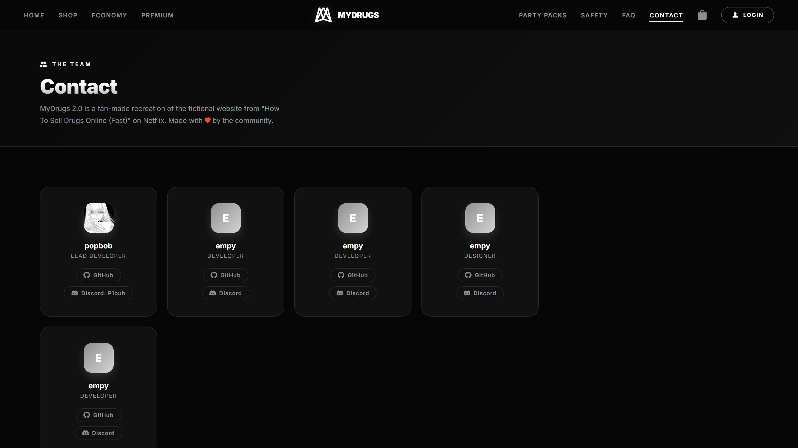

<div align="center">

# 💊 MyDrugs 2.0

**Best Quality. Best Delivery. Best Security.**

> Fan-made recreation of the fictional MyDrugs.to website from the Netflix series *How To Sell Drugs Online (Fast)*.


[📺 About the Show](https://www.netflix.com/title/80233478)



</div>

## 📸 Screenshots

| Home — Hero Carousel | The Shop |
|:---:|:---:|
|  |  |
| **Economy Bundles** | **Premium Selection** |
|  |  |
| **Party Packs** | **Safety Guide** |
|  |  |
| **FAQ** | **Contact / Team** |
|  |  |

---

## 🧩 Overview

MyDrugs 2.0 is a **frontend-only fan project** that recreates the look and feel of the fictional darknet marketplace from the Netflix series. It's built entirely with modern web technologies — no backend, no database, no real transactions.

> ⚠️ **This is a fictional project for educational/entertainment purposes. No real substances are involved or sold.**

---

## ✨ Features

| Feature | Description |
|---------|-------------|
| 🔞 **Age Gate** | Splash screen that verifies users are 18+ (persisted to localStorage) |
| 🎠 **Hero Carousel** | Animated pill showcase with auto-rotation, ratings, and buy/add controls |
| 🛒 **Product Shop** | Full catalog with search, filters, sorting, favorites, quantity controls |
| 💰 **Economy Bundles** | Discounted multi-item bundles with savings display |
| 💎 **Premium Selection** | Curated premium products with rating filter |
| 🎉 **Party Packs** | Themed multi-item packs (Festival, Rave, Chill, Full Collection) |
| ❓ **FAQ Accordion** | Expandable Q&A covering security, shipping, payments, and safety |
| 🛡️ **Safety Guide** | Harm reduction information with emergency warning section |
| 📬 **Contact Page** | Team/contributor cards with social links and disclaimer |
| 🛍️ **Cart Drawer** | Slide-out panel with item management and checkout flow |
| 🔐 **Login Modal** | Simulated authentication UI with PGP encryption indicator |
| 📱 **Responsive Design** | Mobile-friendly with hamburger menu and adaptive layouts |
| 🔄 **Currency Toggle** | Switch between BTC and ETH display prices |
| 🌙 **Dark Theme** | Full dark UI with glassmorphism and particle animations |

---

## 🛠️ Tech Stack

| Category | Technology |
|----------|-----------|
| **Framework** | [React 19](https://react.dev/) |
| **Language** | [TypeScript 5.9](https://www.typescriptlang.org/) |
| **Build Tool** | [Vite 7](https://vitejs.dev/) |
| **Styling** | [Tailwind CSS 4](https://tailwindcss.com/) |
| **Routing** | [React Router 7](https://reactrouter.com/) |
| **Icons** | [Bootstrap Icons](https://icons.getbootstrap.com/) |
| **Bundling** | [vite-plugin-singlefile](https://github.com/richardtallent/vite-plugin-singlefile) |

---

## 🚀 Getting Started

### Prerequisites

- Node.js 18+
- npm 9+

### Installation

```bash
git clone https://github.com/AnonymoDGH/MyDrugs.git
cd MyDrugs
npm install
```

### Development

```bash
npm run dev
```

Opens at `http://localhost:5173` with HMR.

### Build

```bash
npm run build
```

Outputs a single `index.html` (all JS/CSS inlined) to `dist/`.

### Preview

```bash
npm run preview
```

---

## 📁 Project Structure

```
MyDrugs/
├── index.html              # Entry HTML
├── vite.config.ts          # Vite config (React + Tailwind + singlefile)
├── tsconfig.json           # TypeScript config
├── package.json            # Dependencies & scripts
└── src/
    ├── main.tsx            # React entry point (BrowserRouter)
    ├── App.tsx             # Root component — routing, cart, auth state
    ├── index.css           # Global styles (~2000 lines of dark theme CSS)
    ├── utils/
    │   └── cn.ts           # Tailwind class merge utility (clsx + tailwind-merge)
    └── components/
        ├── AgeGate.tsx     # 18+ verification splash
        ├── Header.tsx      # Nav bar + ticker banner + mobile menu
        ├── Hero.tsx        # Homepage pill carousel
        ├── Shop.tsx        # Product catalog page
        ├── Economy.tsx     # Bundle deals page
        ├── Premium.tsx     # Premium selection page
        ├── Packs.tsx       # Party packs page
        ├── FAQ.tsx         # Accordion FAQ page
        ├── Safety.tsx      # Harm reduction guide
        ├── Contact.tsx     # Team/credits page
        ├── CartDrawer.tsx  # Slide-out cart panel
        └── LoginModal.tsx  # Login/register modal
```

---

## 🌐 Deployment

The app is a **static SPA** — deploy anywhere that serves HTML:

```bash
npm run build
# Upload dist/index.html to Netlify, Vercel, Cloudflare Pages, etc.
```

---

## 📜 Disclaimer

This project is a **fan-made tribute** and is not affiliated with Netflix, the series *How To Sell Drugs Online (Fast)*, or any of its creators. All product names, images, and references belong to their respective owners. No illegal activity is promoted or facilitated.

---

<div align="center">

Made with 💊 by [AnonymoDGH](https://github.com/AnonymoDGH)

</div>
